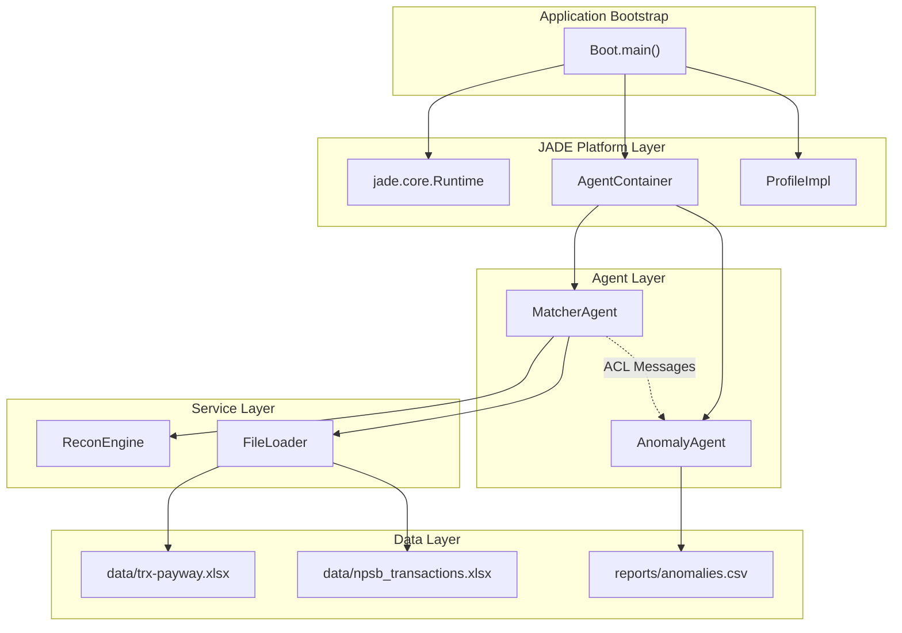
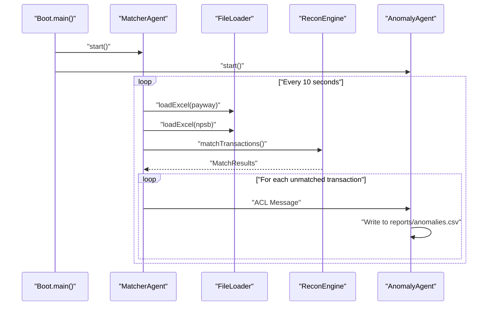

# Matcher Recon Agent

A JADE-based multi-agent transaction reconciliation platform that automatically matches and validates financial transactions between different data sources.

## Architecture Overview

The system follows a multi-agent architecture pattern built on the JADE (Java Agent DEvelopment Framework) platform, consisting of autonomous agents that communicate via ACL messages to perform distributed transaction reconciliation.

### System Architecture Diagram



## Core Components

### 1. Boot Service
The system entry point that initializes the JADE runtime environment and creates agent containers.

### 2. MatcherAgent
Responsible for loading transaction files, performing reconciliation matching, and sending unmatched transactions to the AnomalyAgent.

### 3. AnomalyAgent
Receives unmatched transaction data and writes anomaly reports to CSV files.

## Technology Stack

- **Java 17**: Target runtime environment
- **JADE 4.5.0**: Multi-agent system framework
- **Apache POI 5.2.5**: Excel file processing
- **Log4j 2.20.0**: Logging framework
- **Maven**: Build automation and dependency management

## Data Flow



## Prerequisites

- Java 17 or higher
- Maven 3.6+
- Input data files in `data/` directory:
  - `trx-payway.xlsx`
  - `npsb_transactions.xlsx`

## How to Run

### 1. Build the Project

```bash
mvn clean compile
```

### 2. Package the Application

```bash
mvn package
```

This creates a self-contained JAR with all dependencies using the Maven Assembly plugin.

### 3. Run the Application

```bash
java -jar target/matcher-recon-agent-1.0-SNAPSHOT-jar-with-dependencies.jar
```

Or run directly with Maven:

```bash
mvn exec:java -Dexec.mainClass="com.matcherrecon.service.Boot"
```

### 4. Monitor the System

The application will:
- Start the JADE GUI for agent monitoring
- Process transaction files every 10 seconds
- Generate anomaly reports in `reports/anomalies.csv`

## Project Structure

```
matcher-recon-agent/
├── src/main/java/com/matcherrecon/
│   ├── agent/
│   │   ├── MatcherAgent.java      # Transaction matching agent
│   │   └── AnomalyAgent.java      # Anomaly reporting agent
│   ├── service/
│   │   └── Boot.java              # Application entry point
│   └── utils/
│       └── FileLoader.java        # Excel file processing utility
├── data/                          # Input transaction files
├── reports/                       # Generated anomaly reports
├── pom.xml                        # Maven configuration
└── README.md
```

## Configuration

The system uses Maven properties for configuration:

- **Java Version**: 17
- **Encoding**: UTF-8
- **Main Class**: `com.matcherrecon.service.Boot`

